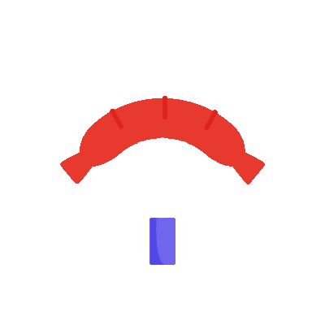

## Celery & Wings

      

A project on restaurant application where users can order food online before they reach restaurant,  based on Node.js.

### Installation and Setup Instruction:

First you need to have `git`, `node` and `npm` installed. You can find `git` [here](https://git-scm.com) and `node` [here](https://nodejs.org).

Now clone this repo, use `git clone https://github.com/Animesh-456/Restaurant-Application.git`

Now use `npm install` to install all the required dependencies.

To start the app (in dev environment) use `npm run devStart` or you can use `npm run start` too.

Now open your browser of choice on your local machine and navigate to `localhost:3000`

## Tools Used:

 
   
   
   
    
   
      
  

## Contributors:

